## Lunch and Learn Schedule

| Session Number | Date       | Session Title                                             | Relevant Certification                    |
|----------------|------------|-----------------------------------------------------------|-------------------------------------------|
| 1              | 2025-01-23 | Azure Fundamentals: Introduction to Cloud Computing and Azure | Azure Fundamentals (AZ-900)              |
| 2              | 2025-02-03 | Azure Fundamentals: Core Azure Services                   | Azure Fundamentals/Administrator (AZ-900/AZ-104)              |
| 3              | 2025-02-06 | Azure Fundamentals: Security, Privacy, Compliance, and Trust in Azure | Azure Security Engineer Associate (SC-900) |
| 4              | 2025-02-20 | Azure DevOps: Introduction to DevOps and Azure DevOps     | Azure DevOps Engineer Expert (AZ-400)       |
| 5              | 2025-03-06 | Azure DevOps: Continuous Integration and Continuous Delivery | Azure DevOps Engineer Expert (AZ-400/AZ-204)   |
| 6              | 2025-03-20 | Azure DevOps: Infrastructure as Code with Terraform       | Azure DevOps Engineer Expert (AZ-400)   |

## Agenda

- **[Overview of DevOps principles and practices](#overview-of-devops-principles-and-practices) (10 minutes)**
  - Agile Planning / Project Management Overview
  - Work Items / Azure Boards
  - Retrospectives

- **[Introduction to Azure DevOps services](#azure-storage) (15 minutes)** 
  - Azure Repos
  - Azure Pipelines
- **[Demo](#demo) (15 minutes)**
  - Create a new Azure DevOps project and repository
  - Connect to Azure Repos from git CLI
- **Q&A (15 minutes)**

## Overview of DevOps principles and practices

  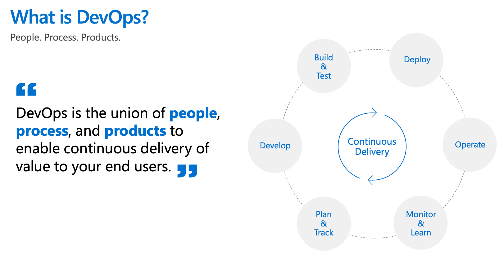
  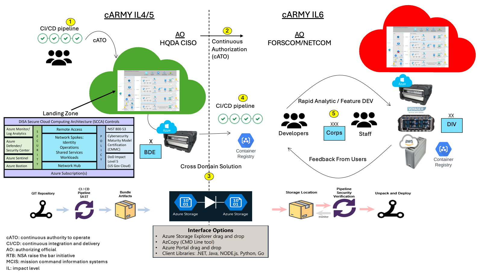

### Agile Planning / Project Management

  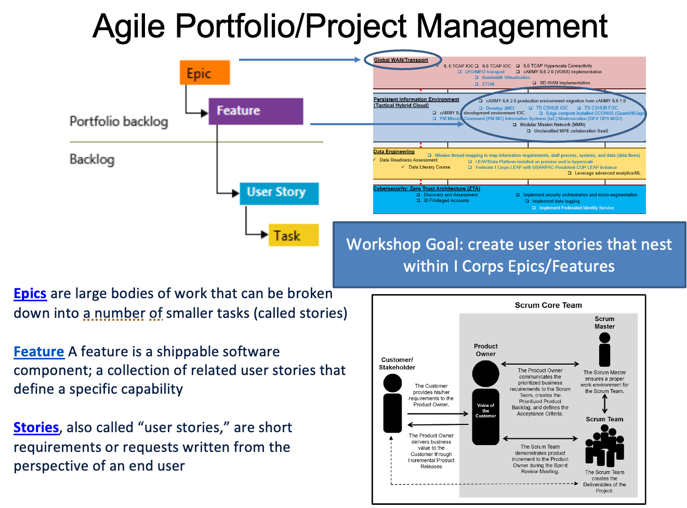

  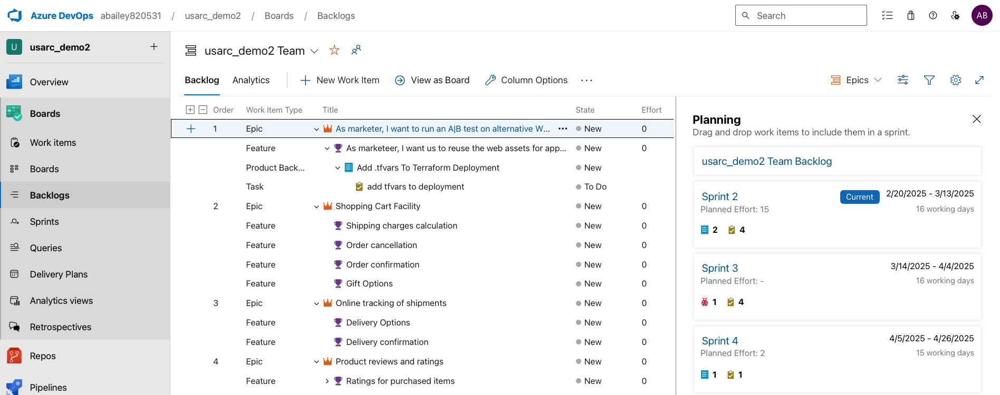
  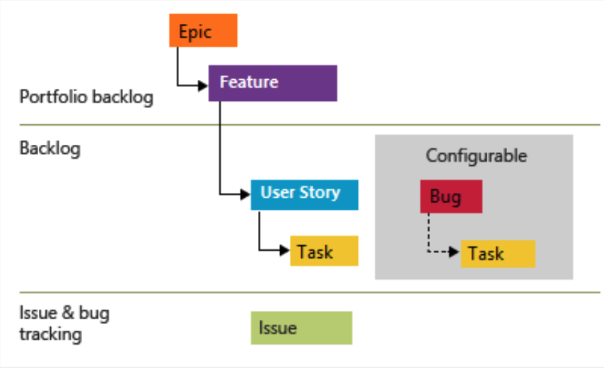

  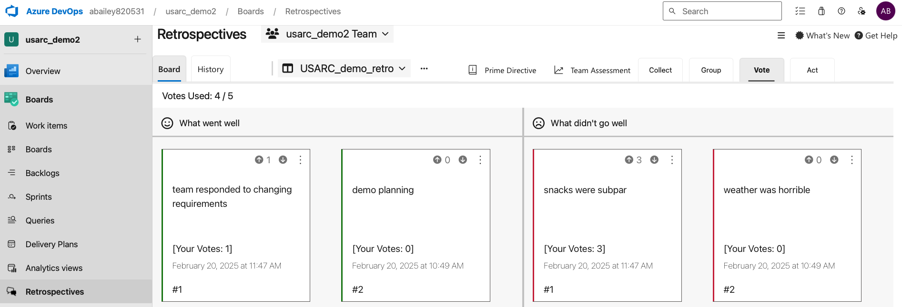

### Additional Resources
- [Azure Devops](https://learn.microsoft.com/en-us/azure/devops/user-guide/what-is-azure-devops?view=azure-devops&toc=%2Fazure%2Fdevops%2Fget-started%2Ftoc.json)
- [Work Items](https://learn.microsoft.com/en-us/azure/devops/boards/work-items/about-work-items?view=azure-devops&tabs=agile-process)
- [DevOps Handbook](https://www.amazon.com/DevOps-Handbook-World-Class-Reliability-Organizations-dp-1950508404/dp/1950508404/ref=dp_ob_title_bk)
- [Scrum Body of Knowledge](https://www.scrumstudy.com/sbokguide/overview-of-sbok)

## Introduction to Azure DevOps services

  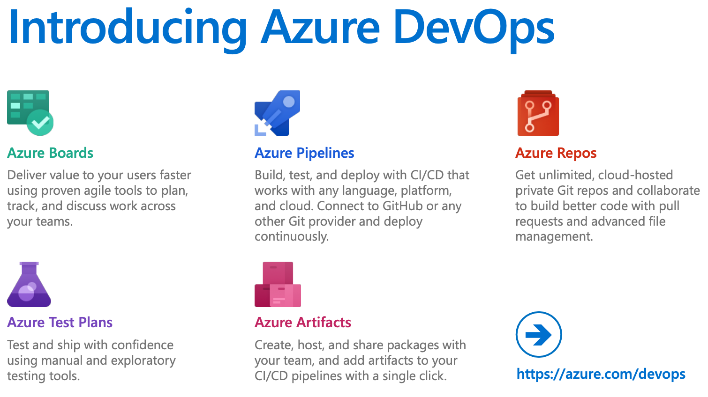

### Azure Repos

  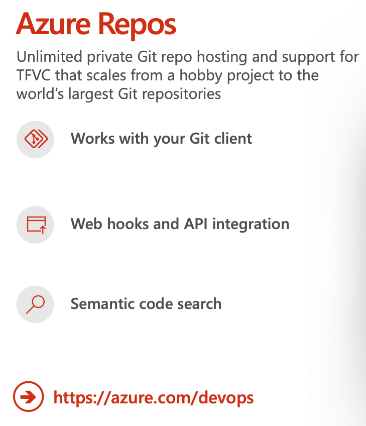
  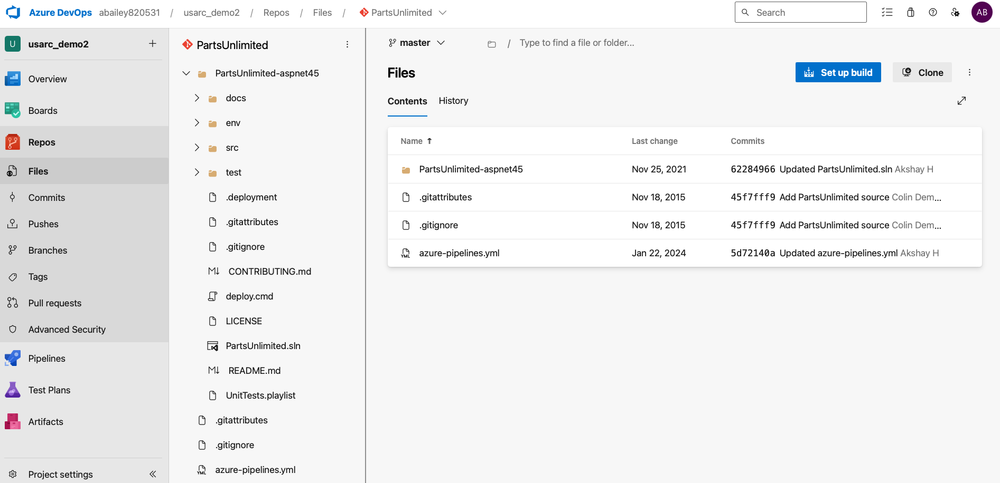

### Azure Pipelines

  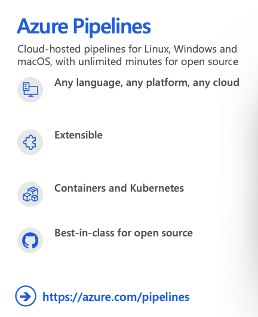
  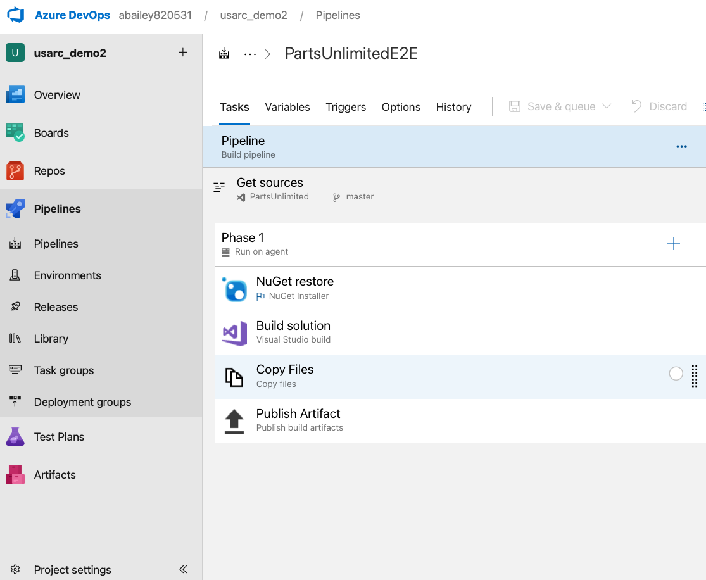

  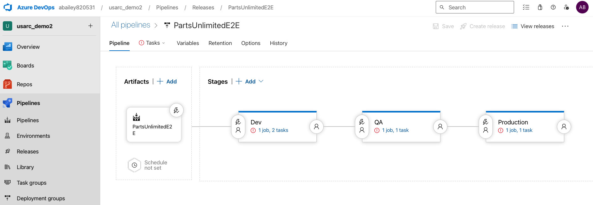

### Azure Boards

  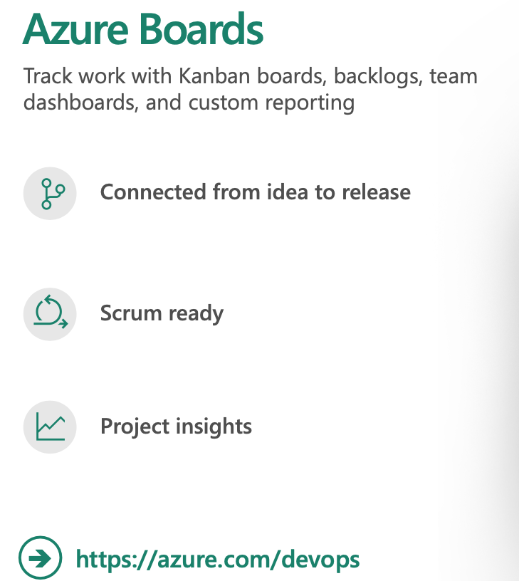
  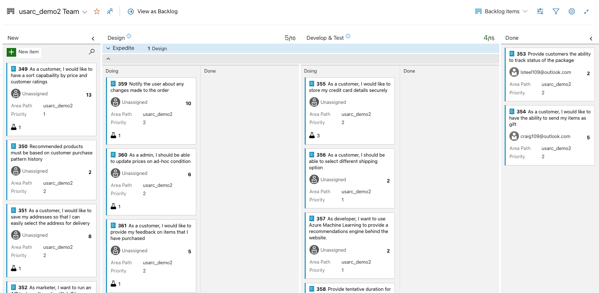

### Additional Resources
- [Azure Repos](https://learn.microsoft.com/en-us/azure/devops/repos/get-started/what-is-repos?view=azure-devops)
- [Azure Pipelines](https://learn.microsoft.com/en-us/azure/devops/pipelines/get-started/key-pipelines-concepts?view=azure-devops)
- [Azure Boards](https://learn.microsoft.com/en-us/azure/devops/boards/get-started/what-is-azure-boards?view=azure-devops)
- [Azure DevOps Demo Generator](https://azuredevopsdemogenerator.azurewebsites.net/)
- [Sampel Azure Devops Cost](https://azure.com/e/d64b33329c954fd8915e35dcca4d3d46)

## Demo
Tasks:
 - create new Azure DevOps project
 - review Azure Repos, Pipelines, and Boards
 - if time permits (trigger a CI/CD pipeline):
    - log into cloud shell
    - clone Azure repository 
    - make change to source code
    - push changes to Azure repository to trigger 